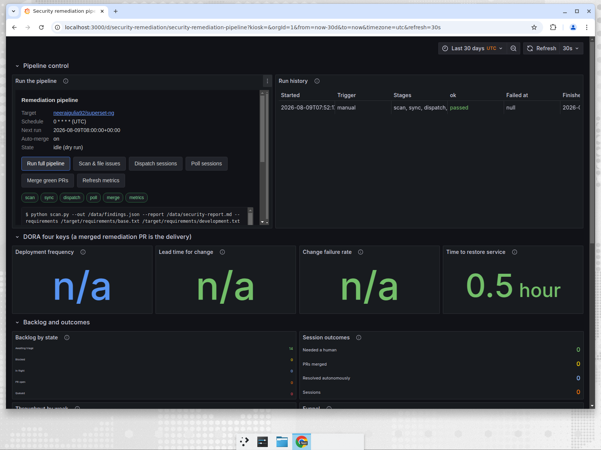

# Superset-NG security remediation pipeline

An event-driven automation that finds vulnerabilities in a fork of Apache
Superset, files them as GitHub issues, hands each one to a Devin session to
fix, and — once the resulting pull request is merged — re-scans the merged
result to prove the vulnerability is actually gone before closing anything.

Two repositories, one system:

| Repository | Role |
| --- | --- |
| **this one** | the solution: pipeline, control plane, dashboard, Docker |
| [`neerajgulia92/superset-ng`](https://github.com/neerajgulia92/superset-ng) | the target: the Superset fork whose issues get filed and remediated |

Nothing about the pipeline is Superset-specific. The target is configuration
(`TARGET_REPOSITORY`), so pointing it at another repository is an `.env` edit.

## Quick start

```bash
git clone https://github.com/neerajgulia92/cognition-solution-superset-ng.git
cd cognition-solution-superset-ng
cp .env.example .env      # fill in GITHUB_TOKEN and DEVIN_API_KEY
docker compose up --build
```

Then open:

| | |
| --- | --- |
| Grafana dashboard | <http://localhost:3000> — `admin` / `admin` |
| Control panel | <http://localhost:8000> |



The dashboard's top row is the control panel: buttons to run the pipeline or
any single stage, the next scheduled run, and the history of every run with
the stage it failed at. Below it are the DORA four keys, the backlog, session
outcomes, throughput and the per-finding table.

### Simulating the workflow

Set `DRY_RUN=true` in `.env` and every stage runs for real — it scans, it
reads the live issues, it decides what it *would* do — but writes nothing to
GitHub and starts no Devin session. It is the honest way to demo the flow
without spending a session or touching the target repository:

```bash
DRY_RUN=true docker compose up --build
curl -X POST localhost:8000/api/run -d '{"stages":["all"]}' -H 'Content-Type: application/json'
```

A dry run prints exactly what a live run would have done:

```
[dry-run] update: #15
[dry-run] queue: #1
## Issue sync
- created: 0
- updated: 3
- queued: 1
```

`DEVIN_API_KEY` is only needed by the dispatch and poll stages; scan, sync,
merge and metrics work with `GITHUB_TOKEN` alone.

## How it works

```
        cron  ────────┐
        button ───────┤
        webhook ──────┘
                      ▼
   scan ─▶ sync ─▶ dispatch ─▶ poll ─▶ [merge] ─▶ verify ─▶ metrics
    │       │         │         │        │          │         │
  OSV +   GitHub   Devin API  session  engineer   re-scan   Grafana +
  bandit  issues   sessions    state   merges     proves   METRICS.md
                                       the PR     it gone
```

| Stage | Script | What it does |
| --- | --- | --- |
| `scan` | `pipeline/scan.py` | queries OSV for every pinned Python dependency, normalises `npm audit` output, and picks security-relevant bandit rules. Each finding gets a stable fingerprint. |
| `sync` | `pipeline/sync_issues.py` | one issue per finding, deduplicated by fingerprint, and labels `QUEUE_UNTRIAGED` of the untouched ones `devin-fix`. |
| `dispatch` | `pipeline/dispatch.py` | `POST /v1/sessions` per queued issue, with a prompt built from the finding and a structured output schema forcing back a verdict and a pull request URL. |
| `poll` | `pipeline/poll.py` | `GET /v1/sessions/{id}`, moves the labels, rewrites one status comment in place. |
| `merge` | `pipeline/merge.py` | optional (`AUTO_MERGE`). Merges the remediation pull request once every check run and commit status has passed and GitHub reports it mergeable. Off by default, so an engineer reviews and merges. |
| `verify` | `pipeline/verify.py` | for each merged fix, checks whether the finding's fingerprint still appears in the run's fresh scan. Gone → comments and closes the issue; still there → reopens it as `devin-blocked`. |
| `metrics` | `pipeline/metrics.py` | rebuilds each finding's journey from what the pipeline wrote on the issues and renders the dashboard. |

### Closing the loop

The pipeline does not treat a merge as a fix. A merged pull request only means
a session wrote a change and a reviewer accepted it; nobody re-ran the scanner
against the result. So the loop closes like this:

1. The fix pull request is merged (by you, or by `merge` if `AUTO_MERGE=true`).
2. The next run's `scan` stage pulls the target's default branch — which now
   contains the merge — and produces a fresh findings document.
3. `verify` compares that document against the fingerprints on the issue. It
   is the only stage allowed to close a finding as fixed.

A scan that ran *before* the merge landed proves nothing, so verification of
such a finding is deferred to the next run rather than decided on stale
evidence. Each verdict is recorded on the issue as a `sec-verified` marker, so
it is reached once and never re-litigated:

```
gone        -> "Fix verified — PR #99 merged", issue closed
still there -> "merged, finding still reproduces", relabelled devin-blocked
```

That last case is the one worth having: it is how a fix that looked right, and
passed review, gets caught.

### State lives on the issues

There is no database. Everything the pipeline needs to resume is a hidden
marker in an issue comment:

```html
<!-- sec-fp: osv:flask:2.3.3 -->          the finding this issue tracks
<!-- devin-session: devin-3d53b7... -->   the session working on it
<!-- devin-metrics: {"verdict": ...} -->  machine-readable status
```

Labels carry the queue state and are what a human sees:

```
devin-fix ─▶ devin-working ─▶ devin-pr-open ─▶ merged ─▶ verified, closed
                   └───────────────────────────────────▶ devin-blocked
```

That is also why any run can pick up where the last one left off, on a fresh
container, with nothing carried between them.

### Triggers

| Trigger | How |
| --- | --- |
| Schedule | `PIPELINE_CRON` (UTC) inside the control service; the next run is on the dashboard |
| Manual | the buttons in the dashboard, or `POST /api/run` |
| Webhook | `POST /api/run` from any scanner, ticket system or CI job |
| Repository activity | a merged fix is itself an event: the next run detects it and verifies it |

The target repository holds no automation of its own — no workflows, no
scripts. It is purely where findings and fixes live, which is why the pipeline
has to observe it from outside rather than be triggered from inside it.

## Observability

`metrics.py` derives everything from what is visible on the issues, so every
number on the dashboard can be traced back to a comment or a label.

- **DORA four keys**, with a merged remediation pull request as the unit of
  delivery: deployment frequency, lead time (session start → merge), change
  failure rate (blocked sessions and rejected pull requests over terminal
  attempts), time to restore (finding filed → issue closed).
- **Status** — backlog by state, sessions in flight, sessions stalled beyond
  24h, and a row per finding with its session, verdict and pull request.
- **Success and failure** — verdict mix (`fixed`, `false_positive`,
  `not_reachable`, `blocked`), resolved-without-human vs needed-human, and the
  one that matters most: fixes merged, fixes *verified* by a re-scan, and
  merged fixes where the finding still reproduces.
- **Throughput** — filed / dispatched / PRs / merged / closed per week, and
  the funnel filed → queued → session → PR with drop-off at each stage.

Outputs: the Grafana dashboard, `GET /metrics.json`, and `METRICS.md` in the
`metrics` volume.

One known gap: a session that dies without writing a status comment reads as
"in flight" until the 24-hour stalled rule catches it. There is no heartbeat.

## Configuration

Every knob is in `.env` (see `.env.example`):

| Variable | Default | Meaning |
| --- | --- | --- |
| `GITHUB_TOKEN` | — | `repo` scope on the target; needs pull request write for `AUTO_MERGE` |
| `DEVIN_API_KEY` | — | from <https://app.devin.ai/settings/api-keys> |
| `TARGET_REPOSITORY` | `neerajgulia92/superset-ng` | what gets scanned and remediated |
| `PIPELINE_CRON` | `0 * * * *` | scheduled run, UTC; `off` disables it |
| `QUEUE_UNTRIAGED` | `1` | findings queued per scan |
| `MAX_SESSIONS` | `1` | sessions started per dispatch |
| `AUTO_MERGE` | `false` | merge remediation PRs automatically once checks pass |
| `CLOSE_RESOLVED` | `false` | close findings the scan no longer reproduces |
| `DRY_RUN` | `false` | run everything, write nothing |

Keep `QUEUE_UNTRIAGED` and `MAX_SESSIONS` small. One session per finding is
real spend, and 15 findings dispatched at once is 15 sessions.

## API

| | |
| --- | --- |
| `POST /api/run` | `{"stages": ["all"]}` or a subset; 409 while a run is in progress |
| `GET /api/status` | current run, schedule, next run |
| `GET /api/runs` | run history |
| `GET /metrics.json` | the metrics document Grafana reads |
| `GET /api/issues` | the findings table, flattened |

## Development

```bash
python -m pytest pipeline/tests -q --noconftest
```

## The findings

The 15 vulnerability findings this pipeline was built against are open as
issues in the target fork:
<https://github.com/neerajgulia92/superset-ng/issues>. They come from three
sources — OSV advisories for pinned Python dependencies, `npm audit` for the
frontend lockfile, and a narrow set of bandit rules (`B324`, `B301`, `B102`,
`B704`, `B310`, `B608`) chosen because they represent real risk rather than
lint noise.
